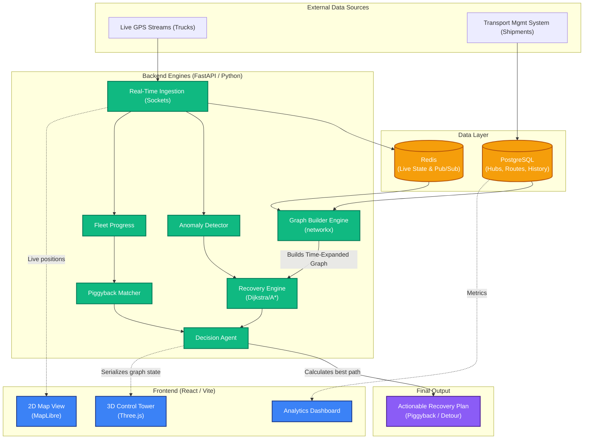

# PiggyShip System Architecture

If the jury asks about the technical architecture of your platform, you can use this document as your guide. It outlines the end-to-end data flow from live tracking to the final recovery recommendation.

## Architecture Diagram

---

## Component Breakdown

### 1. External Data Sources
* **Live GPS Streams:** Continuous telemetry data from active trucks on the road (location, speed, heading).
* **Transport Management System (TMS):** The source of truth for static data like planned shipment routes, hub locations, and truck capacities.

### 2. Data Layer
* **Redis:** Acts as an ultra-fast, in-memory cache for Live GPS positions. It allows the system to process thousands of telemetry pings per second without crashing.
* **PostgreSQL:** Stores persistent relational data like historical shipments, physical hub coordinates, and exact road distance matrices.

### 3. Backend Engines (The Core Intelligence)
The backend is split into **6 specialized engines** working together:
1. **Anomaly Detector (`anomaly_detector.py`):** Continuously monitors the live GPS feed against planned routes to detect misplaced or delayed shipments.
2. **Fleet Progress (`fleet_progress.py`):** Tracks the live progress of all vehicles, calculating their exact locations and ETAs along their routes.
3. **Graph Builder Engine (`graph_network.py`):** Pulls static hubs from Postgres and live truck positions from Redis to dynamically generate the **Time-Expanded (Spatial-Temporal) Graph**.
4. **Recovery Engine (`recovery_engine.py`):** When an anomaly is detected, this engine injects an `entry` node into the graph and runs shortest-path algorithms to find optimal recovery paths.
5. **Piggyback Matcher (`piggyback_matcher.py`):** Evaluates if a misplaced package can be hitched onto an already moving, partially empty truck (Piggybacking).
6. **Decision Agent (`decision_agent.py`):** The final orchestrator that compares standard recovery options vs Piggybacking, weighs the costs/deadlines, and makes the final autonomous decision.

*Note: The real-time ingestion connects via WebSockets/Socket.io to continuously push these decisions to the frontend.*

### 4. Frontend & Final Output
* **2D Map View:** Powered by MapLibre for standard geographic tracking.
* **3D Control Tower:** Powered by Three.js. This takes the massive, complex mathematical graph from the backend and renders it as an interactive 3D visualizer so human operators can explicitly see the "Why" behind the AI's routing decisions.
* **Actionable Output:** The final product is a specific, actionable command (e.g., "Put Shipment 501 on Truck 104 with a 5km detour to Warangal").
