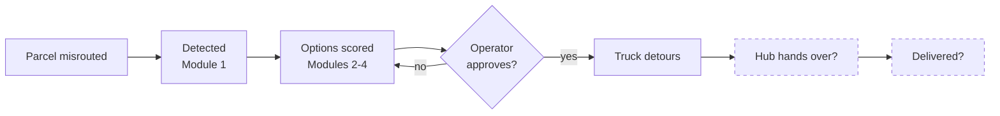

# PiggyShip — Product Opportunity & WOW-Factor Report

As of 2026-09-19

**The biggest opportunity: close the loop.** PiggyShip finds a strong recovery plan, then hands it to one operator and stops. The driver, the hub and the customer never take part. The feature that changes this is a **Recovery Handshake**: approval sends a staging task to the hub and a pickup card to the driver. Each handover is proven by a scan, a decline re-plans instantly, and the customer gets an honest new ETA. It turns a recommendation engine into a recovery network.

## The biggest opportunity

- **User problem.** A recovery only succeeds if a hub worker finds the parcel and a driver actually stops. Today both learn about it by phone, if at all, and the app only *assumes* the handover happened.
- **Why current solutions fall short.** Freight-visibility platforms detect and chase exceptions but don't piggyback. Airline baggage systems reflight bags automatically but own the whole chain. Nobody does piggyback recovery across independent drivers and hubs with proof at each step.
- **What we'd do differently.** Treat each recovery as a short shared mission with three parties, committed times and a scan at every handover. This is the IATA-753 idea (scan at every handover) applied to piggybacking.
- **What it looks like.** Hub phone: "Stage SHP-501 at bay 3 by 14:30". Driver phone, spoken in Telugu: "Stop at Warangal, one parcel, 20 minutes, +₹180". Customer: a live link. Map: the path turns solid as each step is proven.
- **Why users care.** Operators stop phoning. Drivers get clear, paid instructions. Customers stay informed. Managers get proof.
- **Difficulty.** Medium. It needs a task model, two light roles and scan events; the routing and scoring already exist.
- **What makes it special.** It is the only step in the demo where the physical world visibly answers the software.

## Top 10 features to seriously consider

| # | Feature | User problem | Solution | Value | Differentiation | Feasibility | WOW |
| --- | --- | --- | --- | --- | --- | --- | --- |
| 1 | Recovery Handshake | Approval ≠ execution | Hub and driver tasks with accept/decline and scan proof; auto re-plan on decline | Recoveries actually happen, with proof | High: no piggyback tool closes the loop | Medium | Very high |
| 2 | Load Guard | Wrong-truck strays are preventable | Check each loading scan against the truck's route | Fewer strays to recover at all | High | High | High |
| 3 | Consignee rescue link | Customers never know | SMS with a live link and honest ETA | Fewer support calls, trust | Medium | High | High |
| 4 | Five strays, one truck | One-at-a-time planning wastes capacity | Consolidated multi-shipment recovery | Bigger savings per trip | High | Medium | High |
| 5 | Voice pickup in regional languages | Drivers can't use dashboards | Spoken pickup card; yes/no by voice, WhatsApp fallback | Driver adoption | High | Medium | Very high |
| 6 | Recovery inbox + autonomy dial | Approval overload; fear of autopilot | Bulk approve by policy per priority; shadow-mode track record | Hours saved; earned trust | Medium | High | Medium |
| 7 | Plan-changed moment | Silent switches confuse | Animated before/after path with one-sentence reason | Trust in live re-planning | Medium | Very high | High |
| 8 | Time Machine replay | "How did this happen?" | Scrub the map back and replay the incident | Faster root cause; great storytelling | Medium | Medium | Very high |
| 9 | Savings ledger with CO₂ | Benefits are abstract | Per-recovery receipt of ₹, km and CO₂ saved | Business case in one number | Low | Very high | Medium |
| 10 | Root-cause board | Same failures repeat | Clusters strays by hub, shift, type; suggests fixes | Prevention over firefighting | Medium | Medium | Medium |

The Graph 3D fly-through (WOW #16) is the cheapest way to make the core algorithm visible to judges, and pairs well with #7.

## 1. The product today

PiggyShip is a control tower that notices when a parcel has gone astray and finds a truck already heading the right way to carry it home. It detects the problem, compares four ways to fix it, recommends one, and tracks the fix on a live map.

### Who uses it and what they want

| User | Role in the app today | What they actually want |
| --- | --- | --- |
| Logistics operator | Full control tower (LOGISTICS\_OPERATOR) | Fix every stray shipment before its deadline, at the lowest cost, without phoning around |
| Admin | Same screens as the operator (ADMIN) | Trust that the automation is safe, see savings, tune policy |
| Driver | One page that streams phone GPS (DRIVER) | Know what to pick up, where and when, without extra work or unpaid detours |
| Hub staff | Not a user; scans are simulated | Find the stray parcel, stage it, hand it over, and be done |
| Consignee / customer | Not a user | Know where the parcel is and when it will really arrive |
| Carrier / fleet owner | Not a user | Earn from spare capacity, keep drivers on schedule |

### Problems it solves

| Problem | User | Workflow before PiggyShip | PiggyShip's answer | Limitation today |
| --- | --- | --- | --- | --- |
| A parcel lands at the wrong hub or on the wrong truck | Operator | Discovered at the next scan or by a complaint | Module 1 flags wrong hub, wrong vehicle (geofence), stuck (scan gap) and severity | Only reacts after the mistake; no prevention at loading time |
| Recovery is expensive | Operator, finance | Send a dedicated vehicle | Piggyback onto an in-transit truck; four strategies scored | Savings shown per shipment, not planned across shipments |
| Choosing a fix is slow and opaque | Operator | Judgement and phone calls | Ranked options, score breakdown, LLM explanation, what-if | Explanation is on demand; one shipment at a time |
| Plans go stale as trucks move | Operator | Re-plan manually | Re-scored every 5 s with a switching margin | The operator is not told *why* a plan changed unless they open it |
| Executing the fix | Driver, hub | Calls and paper | GPS confirms pickup/unload automatically | Driver and hub are never told, asked or thanked |

### Feature inventory

| Area | What users can do today |
| --- | --- |
| Dashboard | KPI tiles (active, misplaced today, piggybacked, recovery rate, cost saved), live map, alert panel, recommendation cards |
| Live map | Vehicles move on real road geometry; routes, recovery paths, hub and status filters |
| Shipments | Search and filter by status and priority; open any shipment |
| Recovery modal | Four ranked strategies with score breakdown, approve or reject, view route, what-if, scenario simulator, decision agent (explain, risk flags, free-text questions), audit trail |
| Autonomy | Critical severity (> 85) auto-executes; others wait for approval or escalate |
| Live re-planning | Recommendations switch only when a new option beats the current one by a margin or it becomes infeasible |
| Execution tracking | Pickup and unload are detected from GPS along the planned legs |
| Analytics | Recovery outcomes, savings over time, strategy usage, misplacement heatmap |
| Simulation | Demo/live switch, speed, trigger a misplacement, control a vehicle's speed or route |
| Driver page | Start/stop sharing live GPS |
| Graph 3D | Explore the time-expanded network: hubs, legs, waits, detours, recommended paths |

## 2. User journeys and where they break

The operator's journey is complete up to the approve button; every other person's journey barely exists. The recovery happens in the physical world, but the app only talks to one person in the control room.

Dashed steps have no screen, task or confirmation today: the app infers them from GPS.

### Operator

1. Sees an alert or a recommendation card on the dashboard.
2. Opens the recovery modal and reads four strategy cards.
3. Optionally asks the agent why, runs a what-if, or checks the scenario simulator.
4. Approves; watches the truck on the map.

Friction:

- **One shipment at a time.** Five strays at Warangal mean five modals and five approvals, and the engine never considers loading two onto the same truck.
- **Manual interpretation.** The operator reads four score bars and a weights table to decide; the risk flags hide behind a tab.
- **Silent changes.** When the recommendation switches (say TRUCK-102 goes offline), the reason is stored but not pushed as a clear "plan changed because…" moment.
- **The loop stops at approval.** Nothing asks the driver whether they can actually stop, or the hub whether the parcel is really there.
- **No after-action view.** There is no "what happened, what did it save, what caused it" story per shipment or per hub.

### Driver

1. Opens the app, taps Start LIVE GPS.
2. That is the whole journey.

Friction: the driver learns about a pickup only by being phoned. They cannot accept, decline, report a full truck, see where to stop, or prove the handover.

### Hub staff (no role today)

The person who must find the parcel, stage it and hand it to the driver is invisible. The system *assumes* the parcel is where the last scan said. Airlines learned that handovers are the weak point: transfers caused 39% of mishandled bags in 2025 ([SITA](https://www.sita.aero/about-us/pressroom/news-releases/tech-drove-down-mishandled-bag-rates-by-23-in-2025-but-mishandling-still-costs-the-industry-$6.3-billion-a-year)).

### Consignee (no role today)

The customer never learns that the parcel was lost and saved. The recovery that protects the deadline is also the best customer story the product has, and nobody sees it.

## 3. How the world solves this

The closest analogue is not a freight platform. It is airline baggage recovery, which already automates "find the next vehicle going the right way and put the lost item on it". Freight-visibility platforms add the next step: agents that act and talk to people, not just alert.

| System | Problem it solves | Interesting capability | Why it works | Adapt for PiggyShip? |
| --- | --- | --- | --- | --- |
| [SITA WorldTracer Auto Reflight](https://www.sita.aero/solutions/sita-at-airports/sita-baggage-management/sita-worldtracer-auto-reflight) | Delayed bags need a new flight | Picks the connection by business rules and reflights without a human; claims up to 80% of reflights automated and 60% of bags returned in 1.6 days; tells passengers and offers direct delivery | Rules are explicit, so automation is trusted; the passenger is kept informed | Yes: policy-based auto-recovery plus consignee updates |
| [IATA Resolution 753](https://www.iata.org/en/services/certification/operations-safety-security/baggage-tracking/) | Nobody knows where the bag was last touched | Four mandatory scan points: acceptance, loading, transfer, delivery; data shared with handlers and partner carriers | Accountability at every handover | Yes: a "recovery handshake" with a scan at each handover |
| [Apple Find My in WorldTracer](https://www.sita.aero/about-us/pressroom/news-releases/one-year-later-sita-shows-how-integration-of-apples-find-my-share-item-location-can-strengthen-baggage-operations-for-airports-and-airlines/) | The owner knows where the bag is before the airline does | Passenger shares the tag's location; 29 airlines; permanently lost bags down 90%, recovery 26% faster | Uses a signal the customer already has | Yes: let shippers share their own tracker or e-way bill data |
| [FourKites Loft](https://www.fourkites.ai/platform/loft) | Exceptions need follow-up across many people | Named agents contact carriers over email, WhatsApp, voice and SMS, and trigger another agent to reschedule appointments | The system does the chasing, not the operator | Yes: a driver/hub outreach agent on WhatsApp |
| [project44 Movement](https://www.project44.com/blog/the-intelligence-layer-how-agent-analytics-optimization-and-orchestration-transform-exception-management/) | Alerts pile up; humans triage | First decides "can an agent fix this or does it need a human?", then picks the cheapest channel that resolves it in time; claims carrier response above 85% | Triage and channel choice are automated | Yes: auto-triage of which recoveries need the operator |
| [ULIP (India)](https://www.ibef.org/news/unified-logistics-interface-platform-ulip-surpasses-100-crore-application-programming-interface-api-transactions-enabling-seamless-smart-and-sustainable-logistics) | Logistics data is scattered across ministries | 43 systems from 11 ministries through 129 APIs; over 100 crore API calls; [FASTag, Vahan, Sarathi, FOIS](https://www.superprocure.com/blog/ulip-api-impact-on-indian-logistics-comprehensive-discussion/) | One government gateway | Yes: locate partner trucks from FASTag toll crossings without installing an app |
| Emergency dispatch (CAD/AVL) | Send the right unit, fast | Uses live vehicle location to suggest the closest unit; the dispatcher picks from the shortlist ([Wikipedia: CAD](https://en.wikipedia.org/wiki/Computer-aided_dispatch)) | Dispatchers trust a ranked shortlist, not an autopilot | Yes: the recommendation card as a dispatch console |
| Ride pooling (e.g. Uber Pool) | Share a vehicle without upsetting riders | Caps the detour added to riders already aboard, and trades matching wait against detour (common design practice; no source opened) | Protects the existing passenger's promise | Yes: protect the host shipment's deadline as a hard rule, and show it |

### Why it matters in India

- Logistics cost India 7.97% of GDP (₹24.01 lakh crore) in FY 2023–24; small firms spend 16.9% of output on it versus 7.6% for large firms ([DPIIT–NCAER via Logistics Insider](https://www.logisticsinsider.in/indias-logistics-cost-at-7-9-of-gdp-report/)).
- Empty running is the hidden capacity PiggyShip sells. A US study put it at about a third of heavy-truck miles ([Supply Chain Dive](https://www.supplychaindive.com/news/convoy-empty-miles-trucking/559972/)); a comparable Indian figure was not found in this research.
- Mishandling is still costly even where it is best managed: $6.3 billion a year for airlines, about $260 per bag ([SITA](https://www.sita.aero/about-us/pressroom/news-releases/tech-drove-down-mishandled-bag-rates-by-23-in-2025-but-mishandling-still-costs-the-industry-$6.3-billion-a-year)).

## 4. Missing capabilities and better workflows

The gap is not intelligence; the engine is strong. The gap is that the intelligence reaches one person and stops at a decision, instead of reaching everyone and ending at a delivered parcel.

### What users cannot do today

| Question | Missing capability |
| --- | --- |
| What could users learn that they don't? | Why a plan changed; which hubs and shifts cause most strays; the risk a shipment *will* go astray; kilometres and CO₂ avoided |
| What could users do that they can't? | Recover several shipments in one plan; approve by policy instead of one by one; message a driver from the card; hand a recovery to a colleague |
| What is done by hand? | Phoning the driver and the hub; checking the parcel is really on the shelf; telling the customer; writing the incident report |
| What decisions could the app make easier? | Which of five strays to recover first; whether to wait 20 minutes for a better truck; when to give up on piggybacking |
| What could happen automatically? | Driver and hub tasks, consignee ETA updates, re-planning when a driver declines, the after-action report |
| What could happen proactively? | Warn at loading time that a parcel is going onto the wrong truck; warn that a truck with spare capacity is about to pass a stranded parcel |
| What could be more accessible? | Drivers using voice and their own language on a basic phone or WhatsApp; hub staff scanning without training |
| What could be more trustworthy? | Proof of each handover (scan, photo, GPS); a visible track record for auto-execution |
| What could be more collaborative? | Operator, hub, driver and customer in one shared recovery thread |

### Better ways to run the existing workflows

| Workflow | Current | Alternative | User gains | User loses | Effort | Impact |
| --- | --- | --- | --- | --- | --- | --- |
| Approving recoveries | Open a modal per shipment, read four cards, approve | **Recovery inbox**: one list, grouped by hub; approve all "safe" ones in one action; only exceptions need reading | Minutes instead of clicks per shipment | Per-item scrutiny, unless they drill in | Medium | High |
| Trusting automation | Fixed rule: severity > 85 auto-executes | **Autonomy dial per priority tier** with a shadow mode that shows what autopilot *would* have done and its hit rate | Earned, visible trust | A simple rule | Medium | High |
| Executing a piggyback | GPS infers pickup | **Recovery handshake**: hub stages and scans, driver accepts and scans, the system confirms | Proof; early failure detection | A little effort from hub and driver | Medium | Very high |
| Explaining a decision | Ask the agent in a tab | **Explanation on the card**: one sentence with the deciding numbers, always visible | No clicks to understand | Nothing | Low | Medium |
| Handling plan switches | Silent switch, reason stored | **"Plan changed" moment**: toast plus a before/after diff on the map | Never surprised | Nothing | Low | Medium |
| Learning from incidents | Heatmap of counts | **Root-cause board**: top hubs, shifts and causes with a suggested fix and its payback | Fewer strays next month | Nothing | Medium | High |
| Customer communication | None | **Live recovery link** for the consignee with the honest new ETA | Fewer "where is my parcel" calls | Some control over messaging | Low | High |

## 5. Feature ideas by category (Section A: product features)

46 ideas, grouped as asked. The strongest become the WOW concepts and the top 10 later on.

### A. Better existing features

- **Recovery inbox** with bulk approve for low-risk recoveries, grouped by hub.
- **One-line reason on every card**: "TRUCK-102 passes Warangal in 1 h 52 m with 35% free space; ₹1,150 cheaper than a dedicated van."
- **Plan-changed diff**: old path fades, new path draws, reason shown.
- **Deadline countdown ring** on each misplaced shipment, turning amber and red.
- **Map focus mode**: click a stray and everything irrelevant dims.
- **Graph 3D storytelling**: play the recommended path as a flying camera along the time axis.

### B. New user capabilities

- **Consolidated recovery**: one truck collects several strays at one hub.
- **Reserve capacity**: hold space on a truck for a recovery that is still being approved.
- **Hand off a recovery** to another operator, with the whole context.
- **Pin a watch**: "tell me if SHP-503's buffer drops below 1 hour".
- **Manual override with guardrails**: drag a shipment onto a truck on the map; the app shows the score and any rule it breaks.

### C. Automation

- **Driver task dispatch**: pickup card sent the moment a recovery is approved.
- **Auto re-plan on decline**: a driver says no, the next option is offered within seconds.
- **Auto after-action report** per recovery: timeline, cost, saving, cause.
- **Hub staging task**: "move SHP-501 to outbound bay 3 before 14:30".

### D. Proactive features

- **Load guard**: warn at loading time when a parcel's destination is not on the truck's route (stops wrong-vehicle strays before they happen).
- **Rescue window alert**: "best truck for SHP-504 leaves Vijayawada in 25 min".
- **Deadline-at-risk forecast** for shipments that are still on track.
- **Morning brief**: overnight strays, what was fixed automatically, what needs a human.

### E. Intelligent features (only where the user benefits)

- **Root-cause clustering**: groups strays by hub, shift, carrier and misplacement type and names the likely cause.
- **Ask the network**, answered from real data: "which trucks pass Warangal in the next 3 hours with 200 kg free?"
- **Driver reliability learning**: how often each driver accepts and completes detours, used as a score input.
- **Photo check**: the hub's photo of the parcel label is read and matched to the shipment.

### F. Accessibility

- **Voice and regional language** for drivers (Telugu, Hindi, Tamil): the pickup card is read aloud; the driver answers "yes" or "no".
- **WhatsApp or SMS fallback** for drivers without the app.
- **Glanceable driver screen**: one big instruction, one big button, usable in a moving cab.
- **Colour-blind-safe status** everywhere (shape plus colour), extending the existing CVD-safe chart palette.
- **Keyboard-first operator flow** (J/K to move, A to approve).

### G. Collaboration

- **Recovery thread**: one timeline per recovery shared by operator, hub, driver and customer service.
- **Shift handover summary**: what is open, what is at risk, what changed.
- **Partner carrier invitations**: a truck from another carrier can accept a paid piggyback.

### H. Trust and transparency

- **Proof chain**: every handover carries a scan, a photo, GPS and a time.
- **Autopilot track record**: "auto-executed 42 recoveries this week, 41 on time".
- **Why not the others?** One sentence per rejected option.
- **Confidence bands on ETAs** instead of a single time.

### I. Visualisation

- **Time-travel scrubber** on the live map: drag back to the moment of misplacement and replay.
- **Rescue radius**: rings showing where each truck could reach before the deadline.
- **Savings ledger**: km not driven, ₹ saved, CO₂ avoided, per recovery and in total.
- **Corridor capacity strip**: spare kg on each corridor over the next 24 h.

### J. Personalisation

- **Home hub view** for hub managers and regional operators.
- **Personal thresholds**: which alerts ping me, which just log.
- **Driver preferences**: maximum detour, rest windows, preferred language.

### K. New concepts

- **Spare-capacity exchange**: carriers publish spare space on their corridors; PiggyShip matches strays and also ordinary small loads.
- **App-free partner tracking** using FASTag toll crossings through ULIP.
- **Recovery-as-a-service** for small shippers who have no control tower.
- **Network stress test**: "what if Warangal hub closes for six hours?"

## 6. WOW-factor concepts

The test for each: would someone watching a two-minute demo instantly see that this product is different? Effort is S (days), M (1–2 weeks), L (a month or more) for this team and codebase.

| # | Concept | User problem → what happens | What the user sees | Why it feels different | Effort | Demo impact |
| --- | --- | --- | --- | --- | --- | --- |
| 1 | **Recovery Handshake** | Approval is not execution → approving sends the hub a staging task and the driver a pickup card; each confirms with a scan | Three phones light up in sequence; the map path turns from dashed to solid as each handover is proven | The app runs the recovery, not just recommends it | M | Very high |
| 2 | **Voice pickup in Telugu** | Drivers can't read dashboards while driving → the phone speaks "Stop at Warangal hub, bay 3, one parcel, 20 minutes"; driver says "haan" | A driver accepting by voice, the operator card flipping to "accepted" | Built for a truck cab, not an office | M | Very high |
| 3 | **Time Machine** | "How did this happen?" → scrub the map back to the misplacement and replay at 60× | Trucks rewind; the stray's path and every decision point replay | Turns an incident into a story | M | High |
| 4 | **Load Guard** | Wrong-truck strays are preventable → a scan at loading is checked against the truck's route | A red "wrong truck" flash at the loading bay, before departure | Prevention, not recovery | S–M | High |
| 5 | **Five strays, one truck** | Several strays at one hub → one consolidated plan | Five red dots collapse into one lime path; savings counter jumps | Batch optimisation in one click | M | High |
| 6 | **Plan-changed moment** | Silent switches erode trust → old path dissolves, new one draws, one sentence explains | "TRUCK-102 went offline; switched to TRUCK-104, +40 min, still 2 h 10 m early" | The system narrates its own reasoning | S | High |
| 7 | **Autopilot track record** | Operators fear auto-execution → shadow mode scores what autopilot would have done | "Autopilot would have matched you on 47 of 50; 3 differences" | Trust is earned with evidence | M | Medium–high |
| 8 | **Consignee rescue link** | Customers never know → an SMS with a live link | "Your parcel took a wrong turn. It's on TRUCK-102 and will arrive 2 h before the promised time." | Honesty as a feature | S–M | High |
| 9 | **Rescue radius** | Which trucks can still help? → animated reachability rings per truck up to the deadline | Rings shrink as time passes; the winning truck glows | Makes "feasible" visible | S–M | High |
| 10 | **Savings ledger with CO₂** | Benefits are abstract → each recovery logs km not driven, ₹ and CO₂ saved | A live counter: "1,284 km not driven this week" | Sustainability story from the same data | S | Medium–high |
| 11 | **Ask the network** | Operators need quick answers → typed or spoken question answered from live data, with the rows shown | "Trucks passing Warangal in 3 h with 200 kg free: TRUCK-102, 104" highlighted on the map | Answers point at the map, not a chat bubble | M | Medium |
| 12 | **Stress test** | "What if a hub closes?" → close Warangal for 6 h in the simulator | Affected shipments turn amber; recoveries re-plan live | A digital twin you can poke | M | High |
| 13 | **Root-cause board** | The same hub keeps failing → clusters by hub, shift, type | "62% of wrong-hub strays at HYD happen on the 22:00 shift" | From firefighting to prevention | M | Medium |
| 14 | **FASTag ghost trucks** | Partner trucks have no app → positions inferred from toll crossings via ULIP | Grey trucks appear on corridors; one becomes a recovery candidate | Uses Indian public infrastructure | L | High (India-specific) |
| 15 | **Spare-capacity exchange** | Empty space goes unsold → carriers publish spare kg per corridor | A corridor capacity strip; a stray matched to a partner truck | A marketplace, not a tool | L | High |
| 16 | **Graph 3D fly-through** | The time-expanded model is abstract → the camera flies along the recommended path through time | Judges watch the parcel "ride" through hub timelines | Makes the core algorithm tangible | S | High |
| 17 | **Morning brief** | Operators start blind → a one-screen summary spoken or read | "4 strays overnight, 3 fixed automatically, 1 needs you" | Starts the day with the answer | S | Medium |
| 18 | **Photo proof match** | Is the parcel really there? → hub photographs the label; text is read and matched | Green check: "label matches SHP-501, 120 kg" | Physical-world verification | M | Medium–high |
| 19 | **Deadline guardian** | Some on-track shipments will still be late → forecast lateness before misplacement | A shipment turns amber with "likely 40 min late; fix: transfer at Warangal" | Proactive, not reactive | M | Medium |
| 20 | **Drag-to-reassign** | Operators know things the model doesn't → drag a stray onto any truck | Instant score, rule checks and deadline verdict as you hover | Direct manipulation of the plan | M | High |
| 21 | **Driver reward card** | Drivers resent unpaid detours → each accepted piggyback shows the incentive earned | "+₹180 for this pickup" on the driver screen | Aligns the driver with the system | S | Medium |
| 22 | **Handover QR** | Scanning is fiddly → the driver's phone shows a QR the hub scans | One scan closes the handshake step | Removes friction at the weakest point | S | Medium |

## 7. Cross-domain principles

These are principles, not features to copy. Each one points at a PiggyShip feature above.

| Product | Principle | What it becomes in PiggyShip |
| --- | --- | --- |
| Google Maps | Show the recommended route *and* the alternatives, with the one number that separates them ("+12 min") | Cards lead with the deciding difference; alternative paths drawn faintly on the map |
| Google Maps (rerouting) | Announce a reroute and why, at the moment it happens | Plan-changed moment (#6) |
| Linear | Keyboard-first triage and an inbox that empties | Recovery inbox with J/K/A shortcuts and bulk approve |
| GitHub | Every change has an author, a diff and a history | Plan diffs and an audit trail readable as a timeline |
| Stripe | Show the receipt: exactly what was charged and why | Savings ledger and a per-recovery "receipt" |
| Tesla Autopilot | Autonomy is graded and visible; the human can take over instantly | Autonomy dial and autopilot track record (#7) |
| Modern banking apps | Proactive, plain-language alerts ("unusual payment, was this you?") | Load Guard and Deadline guardian phrased as questions with one-tap answers |
| Hospital early-warning scores | One aggregated score that triggers a defined response | Severity already exists; attach a playbook to each band |
| Aviation ops (A-CDM style shared milestones) | Every party sees the same milestones and commits to times | Recovery thread with committed handover times for hub and driver |
| Emergency dispatch | The console recommends, the dispatcher decides, the unit confirms en route | Recommend → approve → driver accepts → scan proof (Recovery Handshake) |
| Duolingo-style streaks | Small visible rewards change behaviour | Driver reward card and hub leaderboards for clean handovers |
| Airline baggage (WorldTracer) | Rules-based automation plus proactive customer updates | Policy-based auto-recovery and the consignee rescue link |

## 8. Supporting technical features (Section B)

Only what the product ideas above need.

| Technical capability | Enables |
| --- | --- |
| New roles: HUB\_STAFF and CONSIGNEE (tokenised link, no login) | Recovery Handshake, rescue link |
| Task entity with states (offered, accepted, declined, done) and socket rooms per hub | Driver and hub tasks, auto re-plan on decline |
| Scan/photo events with GPS and time, stored as the proof chain | Handover proof, Load Guard |
| Multi-shipment matching in Module 2 (shared capacity on one vehicle) | Five strays, one truck |
| Event-sourced history of positions and recommendations (GPS history already in `vehicle_locations`) | Time Machine, plan diffs |
| Shadow-mode scoring log | Autopilot track record |
| WhatsApp/SMS gateway and speech (text-to-speech, simple yes/no recognition) in Indian languages | Voice pickup, driver fallback |
| ULIP integration (FASTag, Vahan) behind a data-source adapter | FASTag ghost trucks, partner verification |
| Emission factors per vehicle type in `config.py` (marked ASSUMPTION) | Savings ledger with CO₂ |
| Reachability computation from the time-expanded graph | Rescue radius |

## 9. Priorities

The ranking favours ideas that combine high user value, real differentiation and a realistic build. Scores are 1–5 (5 = best; for effort, 5 = least effort).

| Feature | User value | Innovation | Differentiation | Feasibility | Effort | WOW |
| --- | --- | --- | --- | --- | --- | --- |
| Recovery Handshake | 5 | 4 | 5 | 4 | 3 | 5 |
| Consignee rescue link | 5 | 3 | 4 | 5 | 4 | 4 |
| Plan-changed moment | 4 | 3 | 3 | 5 | 5 | 4 |
| Load Guard | 5 | 4 | 4 | 4 | 4 | 4 |
| Five strays, one truck | 4 | 4 | 5 | 3 | 3 | 5 |
| Voice pickup in regional language | 4 | 4 | 5 | 3 | 3 | 5 |
| Recovery inbox with bulk approve | 5 | 2 | 3 | 5 | 4 | 3 |
| Autopilot track record | 4 | 4 | 4 | 4 | 3 | 4 |
| Time Machine replay | 3 | 4 | 4 | 4 | 3 | 5 |
| Savings ledger with CO₂ | 3 | 3 | 3 | 5 | 5 | 4 |
| Rescue radius | 3 | 4 | 4 | 4 | 4 | 4 |
| Graph 3D fly-through | 2 | 3 | 4 | 5 | 5 | 4 |
| Root-cause board | 4 | 3 | 3 | 4 | 3 | 3 |
| Drag-to-reassign | 4 | 3 | 3 | 4 | 3 | 4 |
| FASTag ghost trucks | 4 | 5 | 5 | 2 | 1 | 4 |
| Spare-capacity exchange | 5 | 4 | 5 | 2 | 1 | 4 |

### Buckets

- **Quick wins (days):** Plan-changed moment; one-line reason on every card; savings ledger with CO₂; Graph 3D fly-through; morning brief; deadline countdown ring.
- **Strong product features (1–2 weeks each):** Recovery inbox; consignee rescue link; Load Guard; root-cause board; drag-to-reassign.
- **Differentiators:** Recovery Handshake; five strays, one truck; autopilot track record; voice pickup in regional languages.
- **WOW features for the demo:** Recovery Handshake (three phones); plan-changed moment; rescue radius; Time Machine; Graph 3D fly-through.
- **Long-term concepts:** Spare-capacity exchange; FASTag ghost trucks via ULIP; recovery-as-a-service for small shippers; network stress test.

## 10. The ideal product, rebuilt from scratch

The ideal PiggyShip is a recovery network, not a dashboard. It prevents most strays at loading time, fixes the rest by itself within policy, and brings in a human only for the few that need judgement. Every person in the chain gets exactly one clear instruction on the device they already use.

### Ideal experience

1. A parcel is scanned onto the wrong truck. The loader's handheld flashes "wrong truck" and suggests the right one. Most strays end here.
2. If a stray gets through, the network plans a recovery within seconds. It groups strays that share a hub, and protects every host shipment's deadline.
3. Within policy, it acts: the hub gets a staging task, the driver hears the pickup in their language, and the consignee gets an honest update.
4. Each handover is proven by a scan. A decline or a failed handover re-plans instantly.
5. The operator sees an inbox of only the exceptions, each with a one-sentence reason and a single decision.
6. Every recovery ends with a receipt (₹, km and CO₂ saved), and a weekly root-cause board tells managers what to fix.

### Keep, change, add, remove

| Decision | What |
| --- | --- |
| Keep | Time-expanded graph and scoring; four strategies; live re-planning with a switching margin; grounded LLM explanations; audit trail; demo/live simulation |
| Change | One-modal-per-shipment approval → inbox; fixed auto-execute threshold → autonomy dial; hidden explanations → one line on the card; heatmap of counts → root causes |
| Add | Hub staff and consignee roles; driver tasks with accept/decline; proof chain; consolidation; Load Guard; savings ledger |
| Remove or demote | Free-text chat as a destination (keep it as "Ask the network" tied to the map); the Scenario Simulator tab as a separate place (fold what-if into drag-to-reassign) |

### The most impressive interaction

The operator approves one recovery. Three phones on the table light up in order: the Warangal hub phone says "stage SHP-501 at bay 3", the driver's phone speaks the pickup in Telugu, and the customer's phone gets "your parcel took a wrong turn, and it will still arrive two hours early". As each person confirms, the path on the big screen turns from dashed to solid.

## Sources

Pages opened for this report. Product facts come from the PiggyShip repository (spec, `CLAUDE.md`, backend engines and frontend pages); no code was changed.

- [SITA: mishandled bag rates down 23% in 2025, $6.3 billion cost](https://www.sita.aero/about-us/pressroom/news-releases/tech-drove-down-mishandled-bag-rates-by-23-in-2025-but-mishandling-still-costs-the-industry-$6.3-billion-a-year)
- [SITA WorldTracer Auto Reflight](https://www.sita.aero/solutions/sita-at-airports/sita-baggage-management/sita-worldtracer-auto-reflight)
- [SITA: Apple Find My Share Item Location, one year later](https://www.sita.aero/about-us/pressroom/news-releases/one-year-later-sita-shows-how-integration-of-apples-find-my-share-item-location-can-strengthen-baggage-operations-for-airports-and-airlines/)
- [IATA: Baggage tracking (Resolution 753)](https://www.iata.org/en/services/certification/operations-safety-security/baggage-tracking/)
- [FourKites Loft](https://www.fourkites.ai/platform/loft)
- [project44: agent analytics, optimisation and orchestration in exception management](https://www.project44.com/blog/the-intelligence-layer-how-agent-analytics-optimization-and-orchestration-transform-exception-management/)
- [IBEF: ULIP surpasses 100 crore API transactions](https://www.ibef.org/news/unified-logistics-interface-platform-ulip-surpasses-100-crore-application-programming-interface-api-transactions-enabling-seamless-smart-and-sustainable-logistics)
- [SuperProcure: ULIP APIs (FASTag, Vahan, Sarathi, FOIS, ICEGATE)](https://www.superprocure.com/blog/ulip-api-impact-on-indian-logistics-comprehensive-discussion/)
- [Logistics Insider: India's logistics cost at 7.97% of GDP (DPIIT–NCAER)](https://www.logisticsinsider.in/indias-logistics-cost-at-7-9-of-gdp-report/)
- [Supply Chain Dive: one-third of Class 8 truck miles are driven empty](https://www.supplychaindive.com/news/convoy-empty-miles-trucking/559972/)
- [Wikipedia: Computer-aided dispatch](https://en.wikipedia.org/wiki/Computer-aided_dispatch)

Vendor figures (SITA, FourKites, project44) are the vendors' own claims.
