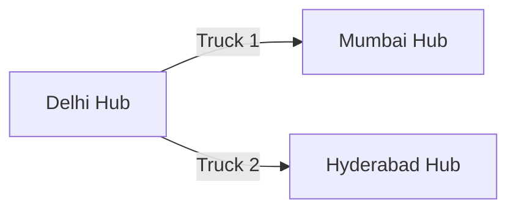
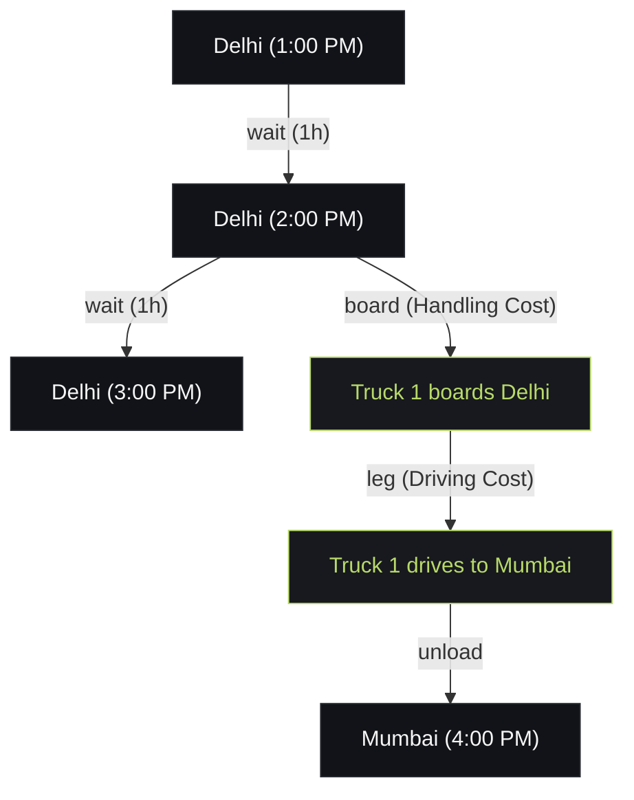

 # Spatial-Temporal Graph (Time-Expanded Network) Guide

This document is your ultimate cheat sheet for explaining the routing intelligence behind PiggyShip. If a judge asks you how your system calculates routes or why it's better than standard Google Maps routing, use the concepts below.

## 1. The Core Problem: Why Static Graphs Fail in Logistics
Standard routing algorithms (like standard Dijkstra or A* on Google Maps) use a **Static Graph**. In a static graph, nodes are locations (Hub A, Hub B) and edges are roads. 

**The fatal flaw for logistics:** A static graph only tells you *where* a truck goes, not *when* it is there. If Hub A connects to Hub B, a static graph assumes you can always make that jump. But in reality, if a package arrives at Hub A at 3:00 PM, and the truck to Hub B left at 2:00 PM, that edge is completely useless. 

PiggyShip solves this by using a **Time-Expanded Network (Spatial-Temporal Graph)**.

---

## 2. What is a Spatial-Temporal Graph?
A Spatial-Temporal Graph adds **Time** and **State** as extra dimensions to the map. Instead of a single node representing "Delhi Hub", the graph generates hundreds of nodes representing "Delhi Hub at 1:00 PM", "Delhi Hub at 2:00 PM", etc. 

### The Dimensions of the Graph
1. **Spatial (Space):** Where is the entity? (e.g., Delhi, Mumbai)
2. **Temporal (Time):** When is the entity there? (e.g., 14:00 UTC)
3. **State (Context):** What is the entity doing? (e.g., waiting at a hub vs. loaded on a truck)

---

## 3. How States Are Represented (Nodes & Edges)

In `graph_network.py`, PiggyShip uses a Directed Graph (`nx.DiGraph`).

### Nodes (The States)
Nodes in PiggyShip are represented as tuples, proving that location alone is not enough. In the 3D graph view, space (hub locations) is mapped on the floor, and time goes upwards on the vertical axis:
*   **Hub Nodes:** `("hub", hub_id, time)` - Represents a package sitting on the floor of a specific hub at a specific timestamp. Drawn on the vertical hub timelines.
*   **Departure Nodes:** `("dep", vehicle_id, stop_idx)` - Represents a truck departing a hub.
*   **Arrival Nodes:** `("arr", vehicle_id, stop_idx)` - Represents a truck arriving at a hub.
*   **Entry Nodes:** `("entry", shipment_id)` - Represents the exact starting point (time and place) of a misplaced shipment being injected into the graph for recovery.
*   **Sink Nodes:** `("sink", dest_hub_id)` - Represents the final goal of the routing algorithm, where time no longer matters once the destination is reached.

### Edges (The Actions)
Edges connect the nodes, but they don't just represent "driving". They represent operations that take time and money.
1.  **`wait`:** An edge connecting `("hub", "DEL", 1:00)` to `("hub", "DEL", 2:00)`. Cost: Low money, high time penalty.
2.  **`board`:** An edge connecting a Hub Node to a Truck Node. Represents the labor of loading a package onto a truck. Cost: `HANDLING_COST`.
3.  **`leg`:** An edge connecting a Truck Node to its next destination. Represents driving.
4.  **`unload`:** An edge connecting a Truck Node back to a Hub Node.

---

## 4. Visualizing the Difference

### Standard Static Graph (Wrong for Logistics)

### Time-Expanded Graph (PiggyShip's Brain)

---

## 5. How is it Updated Dynamically?

If a truck is delayed by a flat tire, a static graph doesn't care. PiggyShip's graph *heals* itself dynamically.

1. **Real-Time Telemetry:** The Simulation Engine (`simulation.py`) tracks live GPS coordinates using the Haversine formula. 
2. **State Mutation:** If a truck slows down, its estimated arrival times shift.
3. **Query-Time Evaluation:** PiggyShip doesn't pre-calculate all edge weights. When a package is misplaced, the Recovery Engine asks the Piggyback Matcher to run Dijkstra's algorithm. 
4. **Dynamic Weights:** During the path search, the edge weights are calculated *at that exact millisecond* using a `_weight_fn`. The weight dynamically blends:
    * Literal financial cost (₹ per km).
    * Time penalties (`VALUE_OF_TIME_PER_HOUR`).
    * Capacity constraints (if the truck filled up 5 minutes ago, the edge is instantly deleted/ignored).

## 6. Answering Common Judge Questions

**Q: "Dijkstra is too slow for thousands of nodes. How does this scale?"**
> "We don't search the whole network. First, we apply Hard Constraints (like capacity, hazmat compatibility, and SLA boundaries) to prune 90% of the edges before running Dijkstra. We only search the feasible sub-graph."

**Q: "Why not just use an ML model to predict the best route?"**
> "Because logistics requires absolute mathematical certainty for compliance, capacity limits, and physics. We use deterministic graph algorithms to guarantee the physically optimal path, and we only use ML/LLMs at the *end* of the pipeline to evaluate soft constraints (like weather or VIP status) that algorithms miss."

**Q: "How does the system know a truck is an option for Piggybacking?"**
> "Because our graph isn't just places; it's places in time. If a package is stranded at Hub A at 3 PM, the algorithm looks for any `Truck Node` scheduled to depart Hub A *after* 3 PM that still has remaining cubic meters (CBM) and kg capacity."
